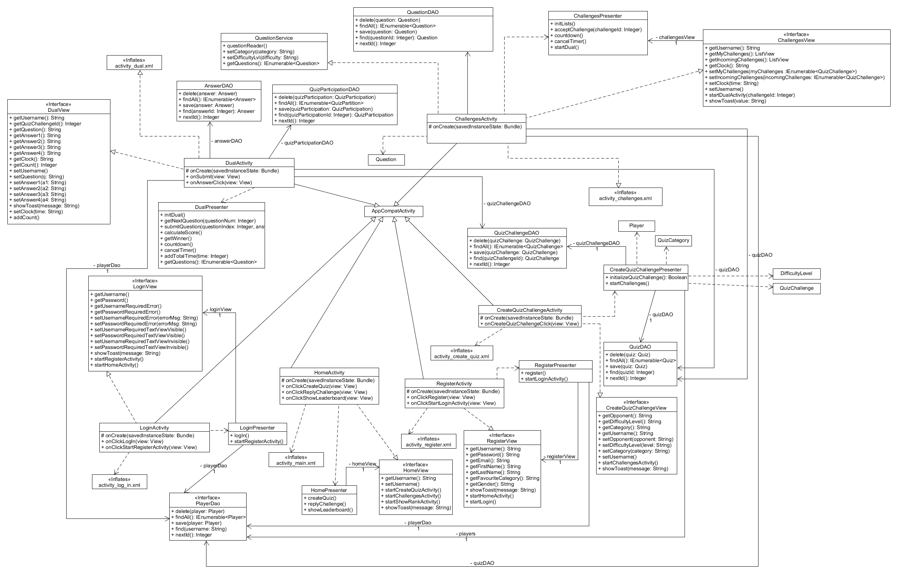
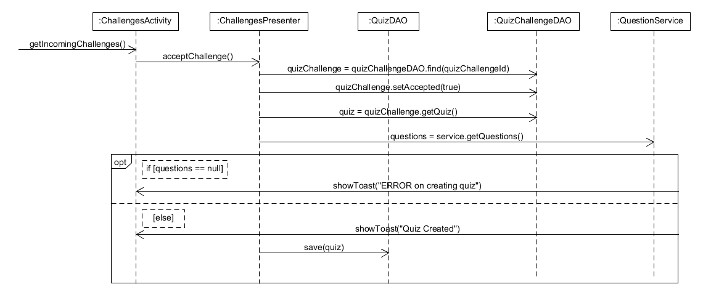
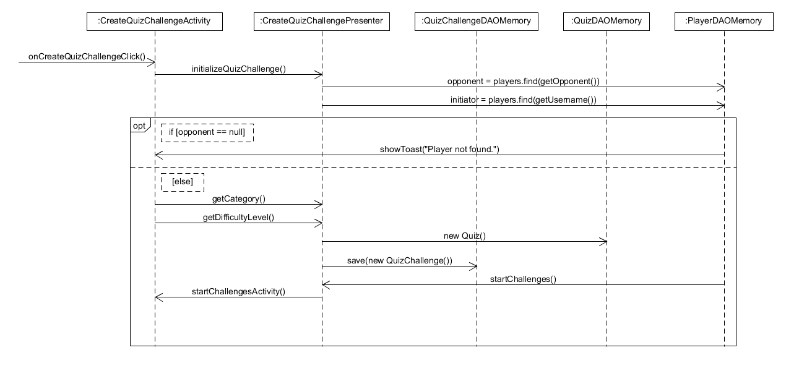
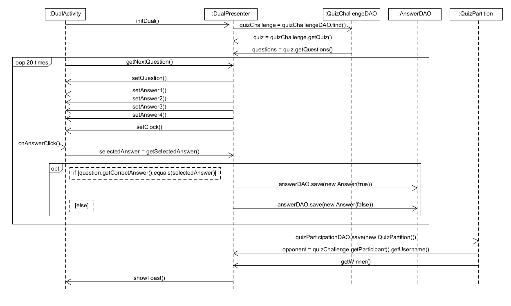
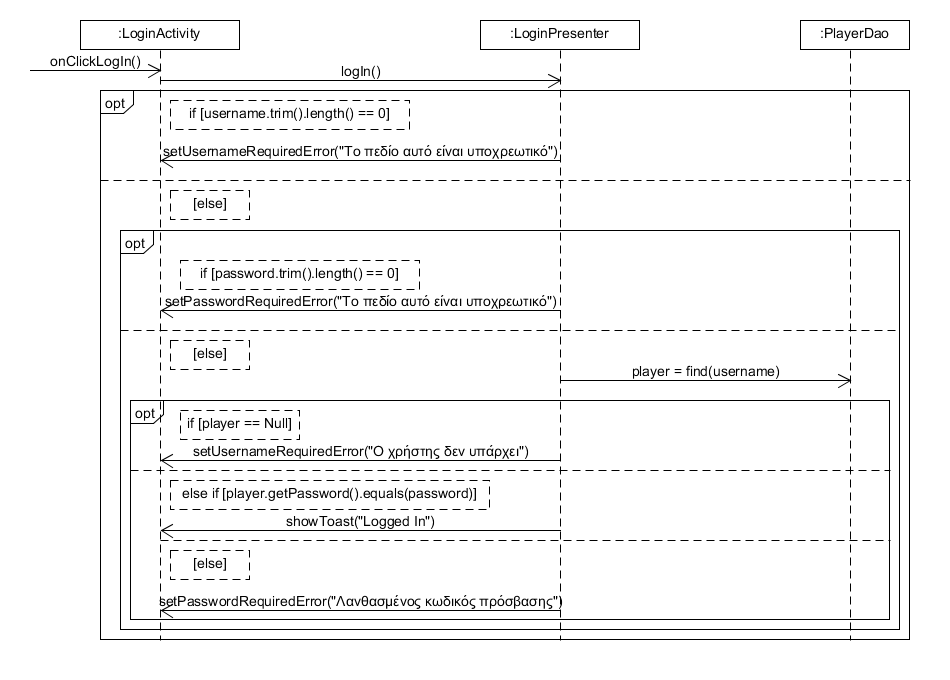

# Εισαγωγή
---
Σε αυτό το έγγραφο σας παρουσιάζουμε διαγράμματα κλάσεων και ακολουθίας που αφορούν τη σχεδίαση όλων
των αρμοδιοτήτων του λογισμικού. Αργότερα υπάρχει εικόνα που παρουσιάζει τα αποτελέσματα της κάλυψης κώδικα στα τεστ που έγιναν.
---
# Διάγραμμα Κλάσεων

# Sequence Διαγράμματα

Τα διαγράμματα ακολουθούν την λογίκη που έγινε στα πλαίσια του παραδοτέου R4

# Αποτελέσματα των Τεστ

/QuizApp/requirements/JUnit%20Test/tests_r4.png)

